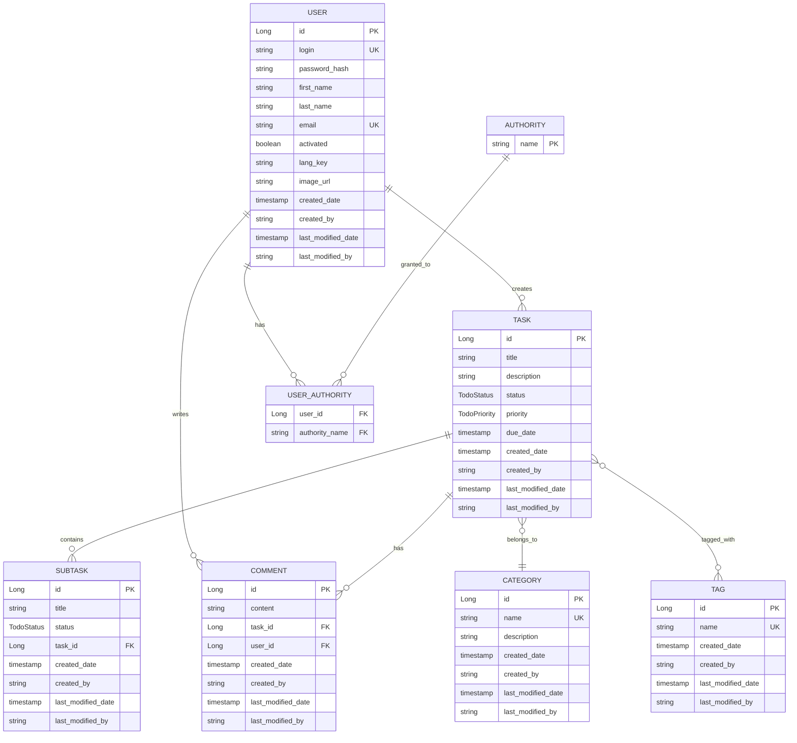
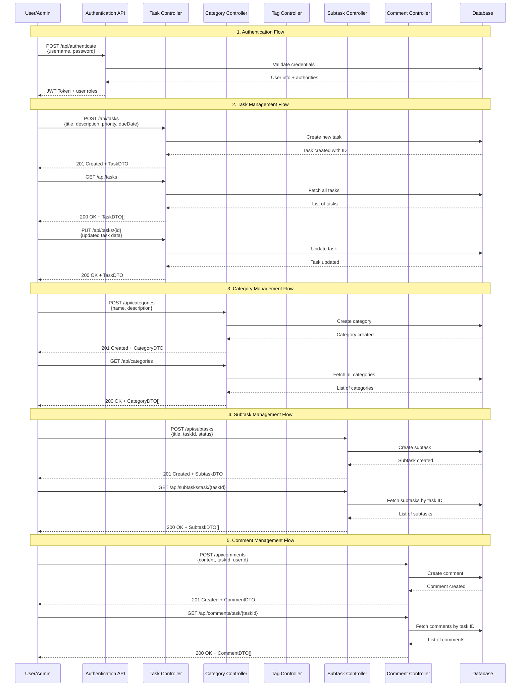

# TodoList Application - Spring Boot & JHipster

Ứng dụng quản lý công việc (TodoList) được xây dựng bằng Spring Boot và JHipster, hỗ trợ quản lý tasks, categories, tags, subtasks và comments với hệ thống phân quyền user/admin.

## 🏗️ Kiến trúc Database

### Entity Relationship Diagram

### Enums

- **TodoStatus**: `PENDING`, `IN_PROGRESS`, `COMPLETED`, `CANCELLED`
- **TodoPriority**: `LOW`, `MEDIUM`, `HIGH`, `URGENT`
- **Authority**: `ROLE_ADMIN`, `ROLE_USER`

## 🔄 Luồng nghiệp vụ chính

### 1. Sequence Diagram - API Interactions

### 2. Business Flow Diagram

```mermaid
graph TD
    A[User Login] --> B{Authentication}
    B -->|Success| C[Get JWT Token]
    B -->|Fail| D[Login Error]

    C --> E[Access APIs]

    E --> F[Task Management]
    E --> G[Category Management]
    E --> H[Tag Management]
    E --> I[User Management]

    F --> F1["Create Task POST /api/tasks"]
    F --> F2["View Tasks GET /api/tasks"]
    F --> F3["Update Task PUT /api/tasks/{id}"]
    F --> F4["Delete Task DELETE /api/tasks/{id}"]
    F --> F5["Search Tasks GET /api/tasks/search"]
    F --> F6["Filter by Status GET /api/tasks/status/{status}"]
    F --> F7["Filter by Priority GET /api/tasks/priority/{priority}"]
    F --> F8["View Overdue Tasks GET /api/tasks/overdue"]
    F --> F9["My Tasks GET /api/tasks/my-tasks"]

    F1 --> J["Add Subtasks POST /api/subtasks"]
    F1 --> K["Add Comments POST /api/comments"]

    G --> G1["Create Category POST /api/categories"]
    G --> G2["View Categories GET /api/categories"]
    G --> G3["Update Category PUT /api/categories/{id}"]
    G --> G4["Delete Category DELETE /api/categories/{id}"]

    H --> H1["Create Tag POST /api/tags"]
    H --> H2["View Tags GET /api/tags"]
    H --> H3["Update Tag PUT /api/tags/{id}"]
    H --> H4["Delete Tag DELETE /api/tags/{id}"]
    H --> H5["Find Tag by Name GET /api/tags/name/{name}"]

    I --> I1{Admin Only}
    I1 -->|Yes| I2["Manage Users GET /api/admin/users"]
    I1 -->|Yes| I3["Create User POST /api/admin/users"]
    I1 -->|Yes| I4["Update User PUT /api/admin/users/{login}"]
    I1 -->|Yes| I5["Delete User DELETE /api/admin/users/{login}"]

    style A fill:#e1f5fe
    style C fill:#c8e6c9
    style D fill:#ffcdd2
    style I1 fill:#fff3e0
    style I2 fill:#f3e5f5
    style I3 fill:#f3e5f5
    style I4 fill:#f3e5f5
    style I5 fill:#f3e5f5
```

## 📋 API Documentation

### Authentication APIs

| Method | Endpoint                       | Description                      | Request Body                                    |
| ------ | ------------------------------ | -------------------------------- | ----------------------------------------------- |
| POST   | `/api/authenticate`            | Đăng nhập hệ thống               | `{username, password, rememberMe}`              |
| GET    | `/api/authenticate`            | Kiểm tra trạng thái đăng nhập    | -                                               |
| POST   | `/api/register`                | Đăng ký tài khoản mới            | `{login, email, password, firstName, lastName}` |
| GET    | `/api/activate`                | Kích hoạt tài khoản              | `?key=activation_key`                           |
| GET    | `/api/account`                 | Lấy thông tin tài khoản hiện tại | -                                               |
| POST   | `/api/account`                 | Cập nhật thông tin tài khoản     | `{firstName, lastName, email, langKey}`         |
| POST   | `/api/account/change-password` | Đổi mật khẩu                     | `{currentPassword, newPassword}`                |

### Task Management APIs

| Method | Endpoint                         | Description                 | Authorization |
| ------ | -------------------------------- | --------------------------- | ------------- |
| POST   | `/api/tasks`                     | Tạo task mới                | User/Admin    |
| GET    | `/api/tasks`                     | Lấy danh sách tất cả tasks  | User/Admin    |
| GET    | `/api/tasks/{id}`                | Lấy chi tiết task theo ID   | User/Admin    |
| PUT    | `/api/tasks/{id}`                | Cập nhật task               | User/Admin    |
| PATCH  | `/api/tasks/{id}`                | Cập nhật một phần task      | User/Admin    |
| DELETE | `/api/tasks/{id}`                | Xóa task                    | User/Admin    |
| GET    | `/api/tasks/status/{status}`     | Lấy tasks theo trạng thái   | User/Admin    |
| GET    | `/api/tasks/priority/{priority}` | Lấy tasks theo độ ưu tiên   | User/Admin    |
| GET    | `/api/tasks/overdue`             | Lấy tasks quá hạn           | User/Admin    |
| GET    | `/api/tasks/search`              | Tìm kiếm tasks theo title   | User/Admin    |
| GET    | `/api/tasks/my-tasks`            | Lấy tasks của user hiện tại | User/Admin    |

### Category Management APIs

| Method | Endpoint               | Description              | Authorization |
| ------ | ---------------------- | ------------------------ | ------------- |
| POST   | `/api/categories`      | Tạo category mới         | User/Admin    |
| GET    | `/api/categories`      | Lấy danh sách categories | User/Admin    |
| GET    | `/api/categories/{id}` | Lấy chi tiết category    | User/Admin    |
| PUT    | `/api/categories/{id}` | Cập nhật category        | User/Admin    |
| DELETE | `/api/categories/{id}` | Xóa category             | User/Admin    |

### Tag Management APIs

| Method | Endpoint                | Description        | Authorization |
| ------ | ----------------------- | ------------------ | ------------- |
| POST   | `/api/tags`             | Tạo tag mới        | User/Admin    |
| GET    | `/api/tags`             | Lấy danh sách tags | User/Admin    |
| GET    | `/api/tags/{id}`        | Lấy chi tiết tag   | User/Admin    |
| GET    | `/api/tags/name/{name}` | Tìm tag theo tên   | User/Admin    |
| PUT    | `/api/tags/{id}`        | Cập nhật tag       | User/Admin    |
| DELETE | `/api/tags/{id}`        | Xóa tag            | User/Admin    |

### Subtask Management APIs

| Method | Endpoint                      | Description               | Authorization |
| ------ | ----------------------------- | ------------------------- | ------------- |
| POST   | `/api/subtasks`               | Tạo subtask mới           | User/Admin    |
| GET    | `/api/subtasks/{id}`          | Lấy chi tiết subtask      | User/Admin    |
| PUT    | `/api/subtasks/{id}`          | Cập nhật subtask          | User/Admin    |
| DELETE | `/api/subtasks/{id}`          | Xóa subtask               | User/Admin    |
| GET    | `/api/subtasks/task/{taskId}` | Lấy subtasks theo task ID | User/Admin    |

### Comment Management APIs

| Method | Endpoint                      | Description               | Authorization |
| ------ | ----------------------------- | ------------------------- | ------------- |
| POST   | `/api/comments`               | Tạo comment mới           | User/Admin    |
| GET    | `/api/comments/{id}`          | Lấy chi tiết comment      | User/Admin    |
| PUT    | `/api/comments/{id}`          | Cập nhật comment          | User/Admin    |
| DELETE | `/api/comments/{id}`          | Xóa comment               | User/Admin    |
| GET    | `/api/comments/task/{taskId}` | Lấy comments theo task ID | User/Admin    |

### Roles & Permissions

- **ROLE_ADMIN**: Quản lý users, có quyền truy cập tất cả endpoints
- **ROLE_USER**: Quản lý tasks, categories, tags, comments của mình

## 📊 Business Logic

### Task Lifecycle

1. **Tạo Task**: User tạo task mới với title, description, priority, due date
2. **Phân loại**: Gán category và tags cho task
3. **Chia nhỏ**: Tạo subtasks để chia nhỏ công việc
4. **Theo dõi**: Cập nhật status (PENDING → IN_PROGRESS → COMPLETED)
5. **Thảo luận**: Thêm comments để trao đổi
6. **Hoàn thành**: Đánh dấu task hoàn thành hoặc hủy bỏ

### Priority Management

- **URGENT**: Cần xử lý ngay lập tức
- **HIGH**: Ưu tiên cao
- **MEDIUM**: Ưu tiên trung bình (default)
- **LOW**: Ưu tiên thấp

### Status Tracking

- **PENDING**: Chờ xử lý (default)
- **IN_PROGRESS**: Đang thực hiện
- **COMPLETED**: Đã hoàn thành
- **CANCELLED**: Đã hủy bỏ
